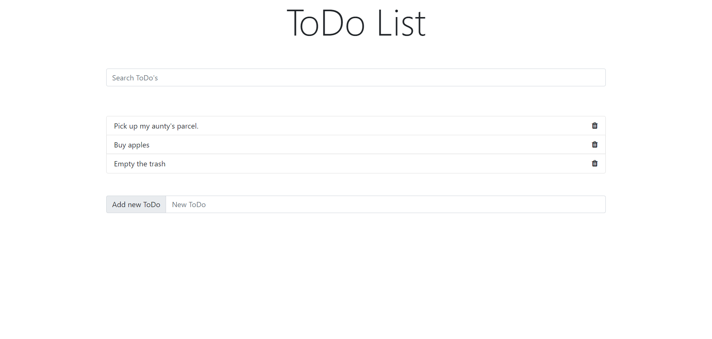
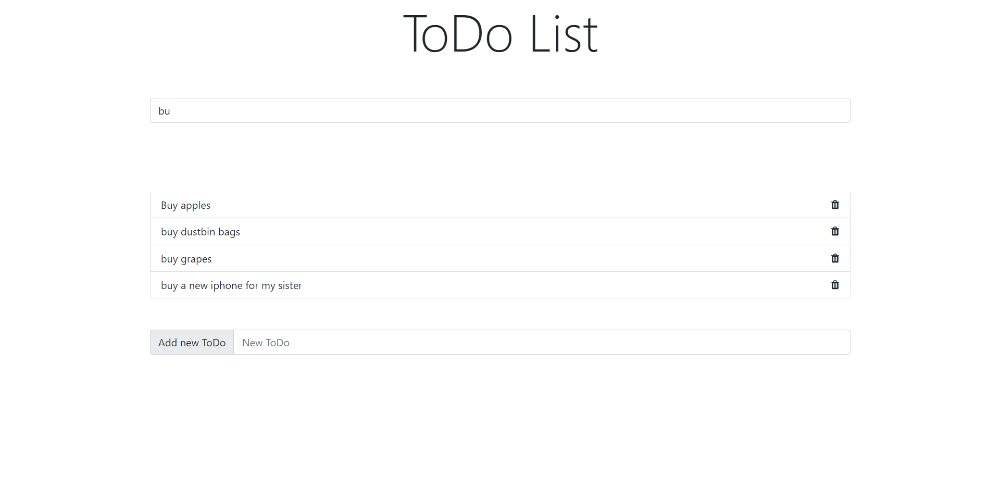

# ToDo

A Webpage having functionality to add a new Todo, delete a Todo when done and Search a Todo from the list of Todo's. Build using HTML, CSS, Bootstrap and Vanilla JavaScript.

#### Concepts used are:

dom manupulation  
querySelector  
HTML forms  
eventListener  
Array.methods : filter, forEach (chaining)
 

### Landing Page

### Searching a Todo

